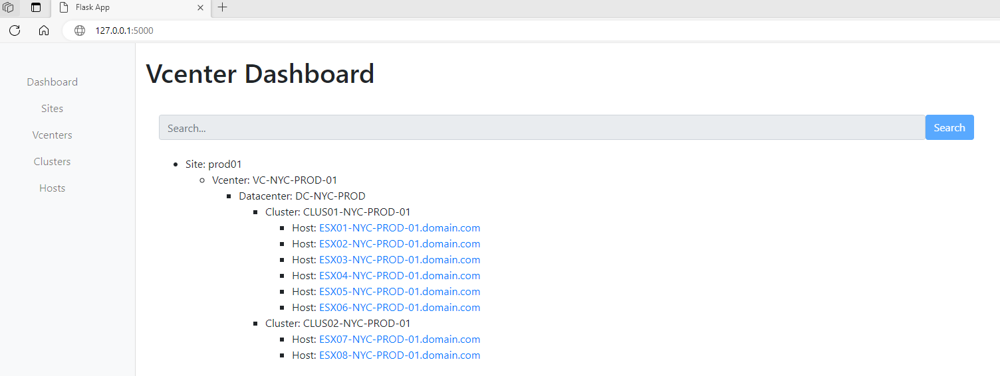
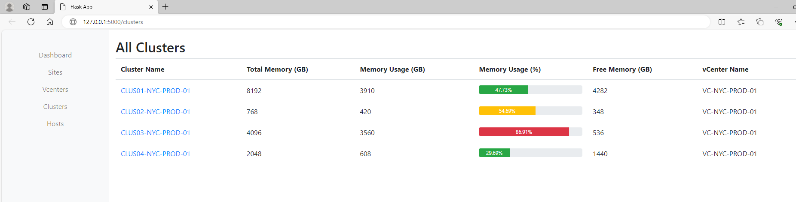
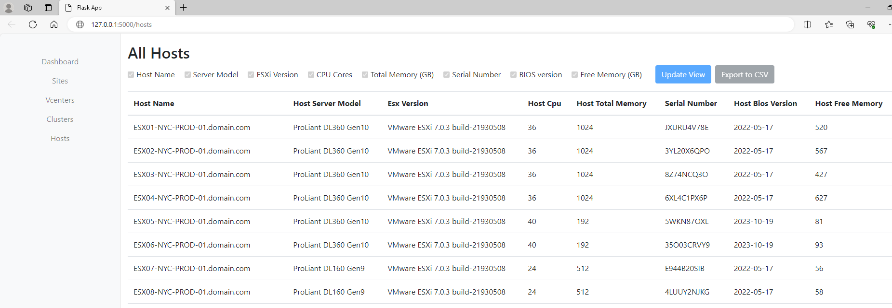
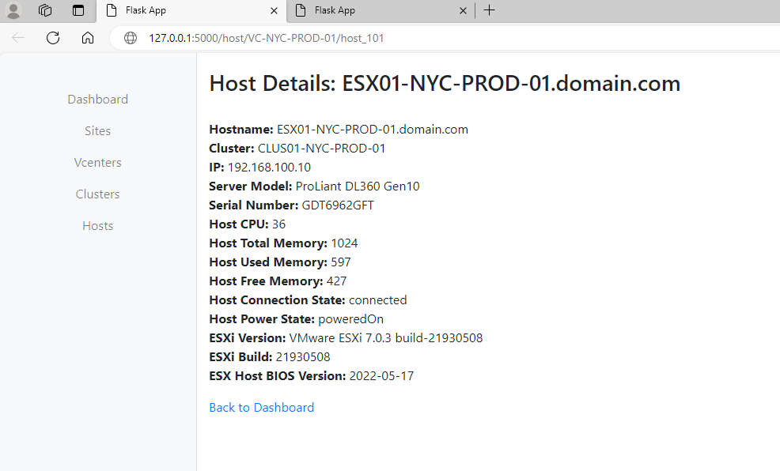

# Vcenters monitor

Vcenter monitor is Python Flask Web App for  monitoring / inventoring multiple VMware Vcenters from one Dashboard via PyVmomi ( Python SDK for the VMware vSphere API )
With this app you can get topology info about multiple vcenters, DCs, clusters and hosts. 
Also you can get usefull inventory info about all connected Hosts : ESX build version, BIOS version, server model, serial number, CPU cores, Total / Free Memory...


## Author
Andrej Jancovic  (2024)

## Installation

### 1. Create Python Virtual Environment in your  project folder

#### python -m venv venv


### 2. Activate Virtual Enviroment
 
#### .\venv\Scripts\activate


### 3) Install required packages from  requirements.txt file via pip

#### pip install -r requirements.txt


### 4) Configure login credentials in vcenters.yaml  based on vcenters.yaml.template

```
- vcenter_name: <Vcenter FQDN>
  ip: <Vcenter IP>
  login: <Vceneter User Login>
  pass: <Vcenter password>
  site: <Vcenetr enviroment tag : Prod, Dev..>

- vcenter_name: <Vcenter FQDN>
  ip: <Vcenter IP>
  login: <Vceneter User Login>
  pass: <Vcenter password>
  site: <Vcenetr enviroment tag : Prod, Dev..>
```

### 5. Run App

#### python app.py


## License

This project is licensed under the GNU General Public License v3.0 - see the [LICENSE](LICENSE) file for details.


<br><br>
## Example Screenshots
### Main Dashboard



<br>

### Clusters



<br>

### Hosts


<br>

### Host details

